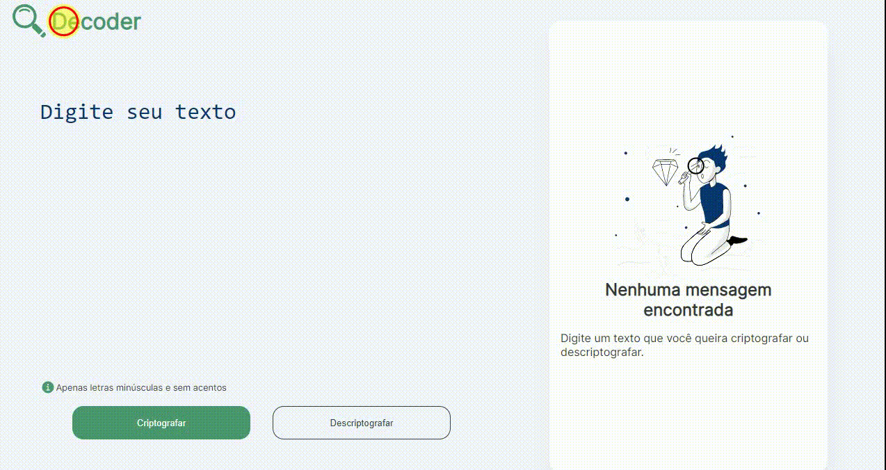

&#xa0;

<h1 align='center'>Decoder</h1>

<!--  -->

<!--  -->

<!--  -->

<a href='#dart-sobre'>Descrição do Projeto Codificador/Decodificador de Texto</a> &#xa0; | &#xa0;
<a href='#sparkles-funcionalidades'>Funcionalidades</a> &#xa0; | &#xa0;
<a href='https://github.com/Elbiabuglio' target='_blank'>Autor</a>

 

## :dart: Descrição do Projeto Codificador/Decodificador de Texto ##

  #Objetivo: Criar uma aplicação web para codificar e decodificar textos, como parte do desafio da turma T6 - ONE do Programa ONE da Oracle + Alura.

## :sparkles: Front-end responsivo ##

Interface construída em HTML e CSS, otimizada para dispositivos móveis e diferentes resoluções de tela.
Ícone em SVG na área de output para telas maiores.

## :sparkles: Funcionalidades ##

#Codificação e decodificação de textos:

Criptografia e descriptografia de mensagens utilizando funções JavaScript.
Manipulação de strings e arrays para realizar as trocas de caracteres.

#Efeitos visuais:

Animações simples no header e botões para aprimorar a experiência do usuário.

#Resultados:

Aplicação web completa e funcional.
Interface responsiva e amigável.
Experiência de usuário otimizada.

  Projeto desafiador e gratificante.
  Aprendizado significativo sobre desenvolvimento web.

Feito com :heart: por <a href='https://github.com/Elbiabuglio' target='_blank'>Elbia Buglio</a>

&#xa0;

<a href='#top'>Voltar para o topo</a>
